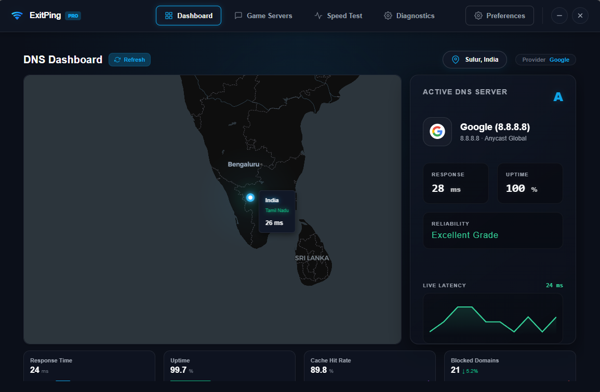
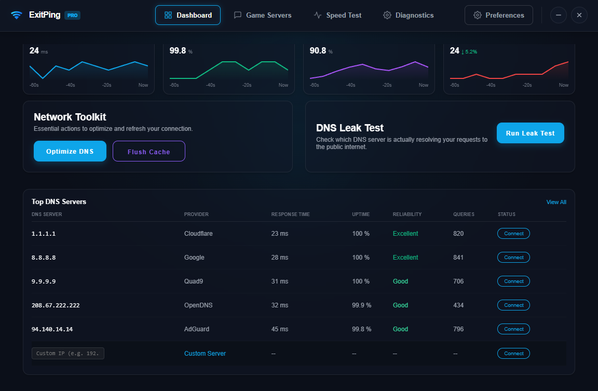
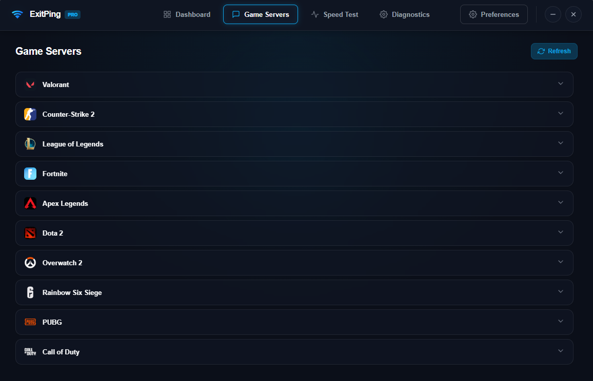
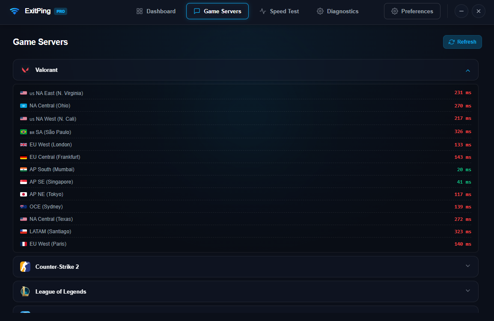
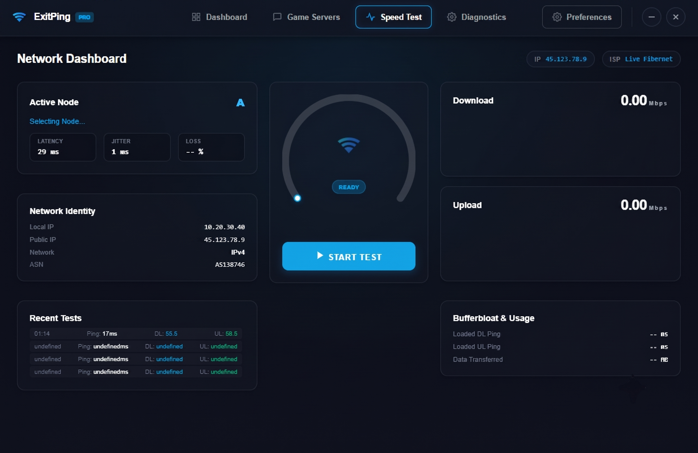
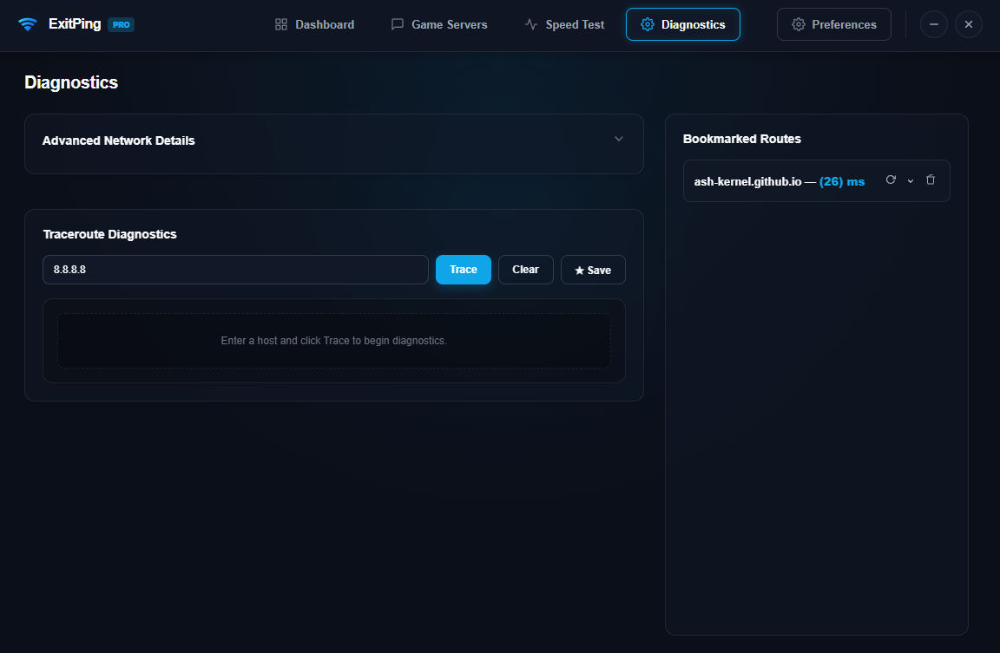
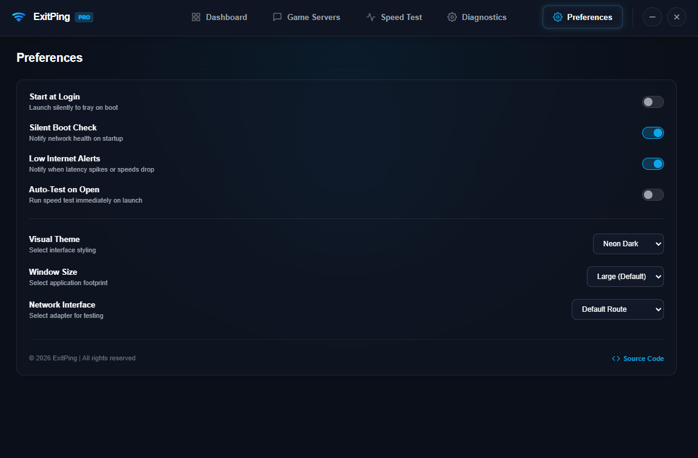

# ExitPing Preview

A clean, modern preview of the app UI.

## Featured

## Screenshots

## Overview

- Dark, glassy interface
- Speed test dashboard with live status
- Game server list and network insights
- Settings panel with startup and alert preferences

## Notes

Use the images above from `assets/readme/` and keep `banner.png` out of this preview.

© 2026 ExitPing — All rights reserved.