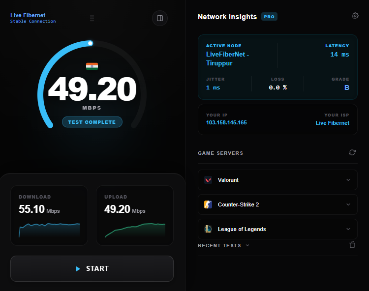

# ExitPing

**An enterprise-grade, minimalist network speed tester for Windows**

ExitPing is a lightweight desktop application that provides real-time, highly accurate internet speed measurements right from your system tray. Built with a dynamic discovery engine and pure TCP latency probing, it delivers professional-grade connection quality insights wrapped in a beautiful, minimalist interface.

## ✨ Features

- **Dynamic Node Discovery** — Automatically queries live, global enterprise nodes based on your exact location (No static lists).
- **Anti-Spike Tick Math** — Replaces outdated cumulative averages with instantaneous median-filtered tick math, guaranteeing flawless accuracy even when the OS buffers data.
- **Pro Network Dashboard** — A clean, slide-out inspector revealing deep network insights including Jitter, Packet Loss, Connection Grade, IP, and ISP.
- **Worldwide Game Telemetry** — Live, accordion-style latency monitoring for official *Valorant*, *CS2*, and *League of Legends* data centers across the globe.
- **Contextual Status Routing** — The UI dynamically reacts to your network health, assigning a real-time grade and status (e.g., "Stable Connection" or "Degraded Routing").
- **Silent Auto-Updater** — Never miss a patch. ExitPing checks for updates seamlessly in the background and presents a sleek, glassmorphism modal when a new version is ready.

## Preview

## Installation

### Download & Install

1. Visit the [Releases](https://github.com/ash-kernel/exitping/releases) page.
2. Download the latest **ExitPing Setup** installer or portable version.
3. Run the installer and follow the setup wizard.
4. Launch from your Start Menu or system tray.

### System Requirements

- **OS:** Windows 10 or later (64-bit)
- **RAM:** 128 MB minimum
- **Internet Connection:** Required for speed testing

## Quick Start

1. **Launch ExitPing** — Click the app icon or run from the system tray.
2. **Click Start** — The dynamic engine will instantly locate the fastest local fiber node and begin the saturation test.
3. **Open the Inspector** — Click the expand icon on the right side of the header to open the Pro Dashboard and view deep network telemetry.
4. **Check Game Pings** — Scroll down in the inspector to check your live routing latency to popular competitive game servers.

## Preferences

Access the settings panel from the Network Inspector to customize:

- **Start at Login** — Launch silently to your system tray when Windows boots.
- **Auto-Test on Open** — Automatically run a full speed sweep the moment the application is launched.

## Troubleshooting

**Tests not running or timing out?**
- Ensure you have an active internet connection.
- Check if a strict firewall is blocking pure TCP socket connections (Port 8080/443).
- The app will automatically fallback to reliable secondary servers if the dynamic API is blocked.

**Inaccurate results?**
- Disable other bandwidth-heavy applications.
- ISPs occasionally throttle specific test endpoints; the built-in `?nocache=` busters help prevent ISP cheating, but VPNs can still heavily alter routing logic.

## Understanding Your Results

| Metric | Description |
|--------|-------------|
| **Download** | Speed at which data is received, tested via 8 parallel streams and instant tick-math (Mbps). |
| **Upload** | Speed at which data is sent, utilizing a static memory buffer and median anti-spike filtering (Mbps). |
| **Latency (Ping)** | True physical-layer response time to the test server (ms). |
| **Jitter** | The variance in latency, crucial for stable competitive gaming and VoIP calls. |
| **Loss** | Packet loss percentage based on extreme ping variance. |
| **Grade** | An algorithmic score (A+ to D) rating the overall health of your routing. |
| **Active Node** | The specific enterprise server currently routing your test. |
| **Game Ping** | Direct routing time to official competitive gaming clusters. |

---

### Creator

[Ash-kernel](https://github.com/ash-kernel)

© 2026 ExitPing | All rights reserved