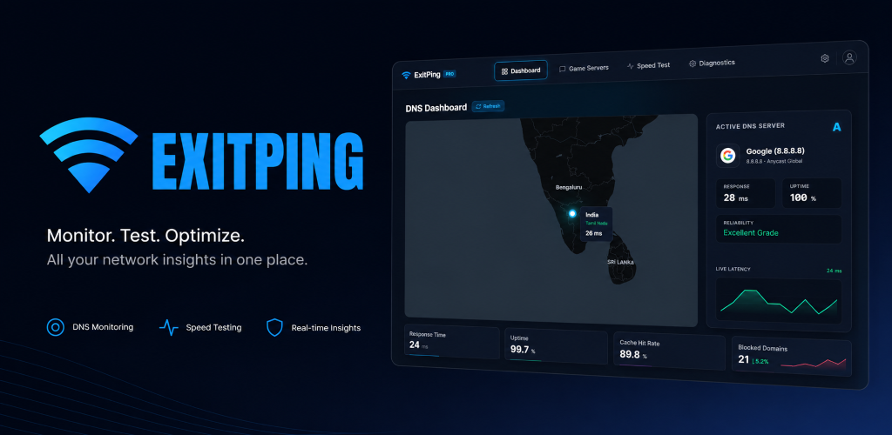
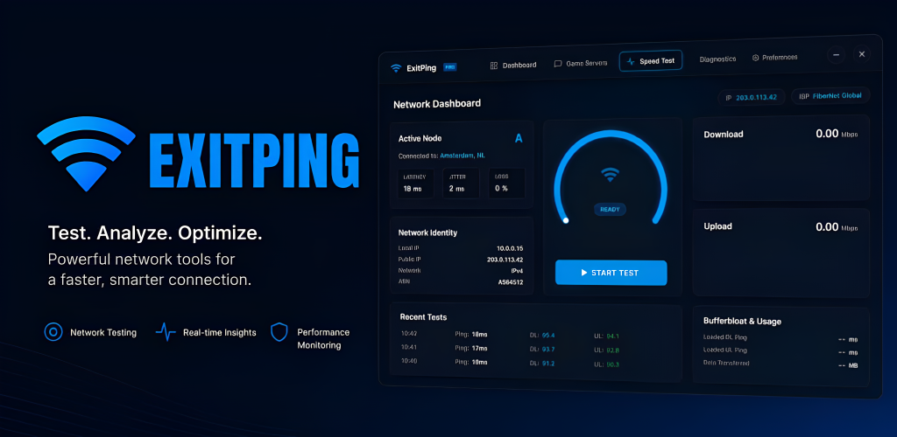

  

   
Lightweight desktop network diagnostics engine with real-time latency monitoring, speed testing, traceroutes, DNS optimization, and live game RTT analysis inside a modern glassmorphism tray-based interface.

[Download](https://github.com/ash-kernel/exitping/releases) • [Security Issues](https://github.com/ash-kernel/exitping/issues) • [Preview](PREVIEW.md)

---

## Featured

  
  &nbsp;
  

---

## Features

### Global Game Server Ping Engine
Monitor real-time Round Trip Times (RTT) across global AWS, Azure, and Google Cloud gaming endpoints before you queue up.
Includes comprehensive regional data centers (with visual country flags) for:
- Overwatch 2
- Rainbow Six Siege
- PUBG
- Call of Duty

### Network Optimization Toolkit
- **DNS Dashboard**: Instantly flush your DNS cache and optimize DNS resolver speeds with a single click.
- **Diagnostics Dashboard**: Reset network adapters, analyze bufferbloat, and troubleshoot packet loss.
- **Traceroutes**: Visual ICMP route tracking with IP geolocation mapping.

### Core Diagnostics
- **Live Latency Graphing**: Low-overhead packet monitoring with background scaling.
- **Speed Testing**: Multi-threaded DL/UL testing with automated warmup cycles for accurate metrics.
- **Tray Integration**: Sits silently in your Windows system tray, ready when you need it.
- **Dynamic Scaling**: Responsive UI with seamless window resizing logic.

---

## Installation

Download the latest installer from the [Releases](https://github.com/ash-kernel/exitping/releases) page.

**Requirements**
- Windows 10/11 (64-bit)
- Active internet connection

---

## License

© 2026 ExitPing — All rights reserved.

Made by [Ash-kernel](https://github.com/ash-kernel)